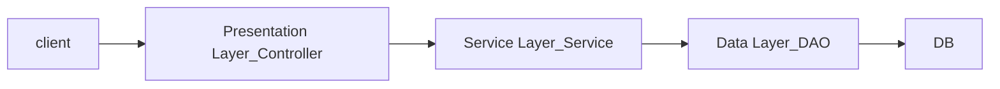
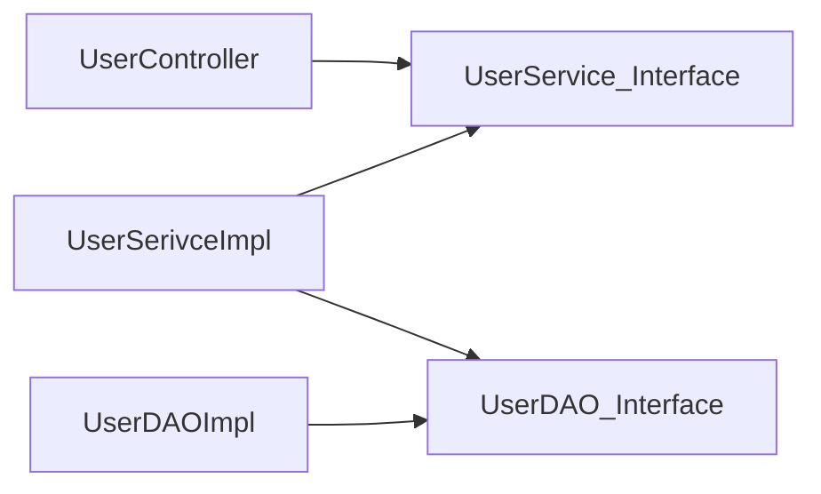

# 💎 스프링 프레임워크 기초 (교육 3회차_230417) {#top}
> created : 2023-04-17
> 
> updated : 2023-04-18
> 
> author : 백민주
##
***
## 🔶 목차
1. [강의 Background](#-강의-background)
2. [Annotation](#-annotation)
3. [Spring Boot 설치](#-springboot-설치)
4. [Springboot 기초 프로그래밍](#-springboot-기초-프로그래밍)
5. [코어기술 1 - IoC](#-코어기술-1-ioc-제어의-역전)
6. [코어기술 2 - AoP](#-코어기술-2-aop)
7. [Spring 구조 실습](#-spring-구조-실습)
    - [구현방법 1. xml 통한 IoC](#구현-방법-1-xml을-통해-ioc를-하는-방법)
    - [구현방법 2. Config 통한 IoC](#구현-방법-2-config를-통해-ioc를-하는-방법)
    - [구현방법 3. Annotation 통한 IoC](#구현-방법-3-bean-등록이-아니라-annotation을-통해-직접-ioc하는-방법---component가-메인)
8. [자바기초](#-자바-기초)
9. [강의요약](https://github.com/juicy100/work_2023/blob/main/01_%EC%88%98%EC%8A%B5/03_%EC%9E%90%EB%B0%94%EA%B5%90%EC%9C%A1(23.4.10-23.4.28)/230418_Day4_%EC%8A%A4%ED%94%84%EB%A7%81%20%EB%B6%80%ED%8A%B8%20%EA%B8%B0%EC%B4%88.md#-review)
***
## 🔶 강의 Background
- **[수업메모](https://gist.github.com/carami/f924bbbca225e9443b25479c477bf6e6)**
***
## 🔶 Annotation
- Class 생성할 때 `@interface`가 Annotation임
- Class 위에 `@Retention(RetentionPolicy.`을 치면 `RUNTIME`, `CLASS`, `SOURECE` 옵션이 뜸
- Annotation : **표식을 나타내는** `@`, 필요한 지점에 붙이면 실행가능
  - 실행방법
    ```
    Method method = hello.getClass().getDeclaredMethod("hello");
            if (method.isAnnotationPresent(Count100.class)) {
                for (int i = 0; i < 100; i++) {
                    hello.hello();
                }
            } else
                hello.hello();
    ```
  - **Annotation 전신을 만들어놓으면 선언해놓은 변수 사용해서 class 구성 가능**
    - Annotation 전신
      ```
      package com.examples.day03;

      import java.lang.annotation.ElementType;
      import java.lang.annotation.Retention;
      import java.lang.annotation.RetentionPolicy;
      import java.lang.annotation.Target;

      @Retention(RetentionPolicy.RUNTIME)
      @Target(ElementType.METHOD)
      public @interface PrintAnnotation {
          String value() default "@";
          int number() default 5;
      }
      ```
    - Annotation 전신을 활용한 class
      ```
      @PrintAnnotation
       public void method1(){
          System.out.println("Method1 실행!!");
       }

      @PrintAnnotation("*")
       public void method2(){
          System.out.println("Method2 실행!!");
       }

      @PrintAnnotation(value = "&", number = 20)
      public void method3(){
        System.out.println("Method3 실행!!");
      }
      ```
***
## 🔶 Springboot 설치
- [설치 방법 1 : 웹 통해서 설치](https://start.spring.io/)
  - Project
    - Maven : Maven Repository에서 지정된 XML 형식의 라이브러리를 알아서 가져오는 방식, 버전 관리의 어려움을 해소
    - Gradle : Maven Repository에 있는 애들을 읽어오는데, 좀 더 쉽게 가져오는 방식, Spring Boot에서는 대부분 Gradle을 
      - 언어 타입 1) Groovy
      - 언어 타입 2) Kotlin
  - Spring Boot 버전 : 최근엔 2.7.10을 많이 사용
  - Project Metadata
    - Group : 패키지명
    - Packaging : Jar - Tomcat(서버)을 모두 포함해서 실행시키는 방식 / War - 서버 제외하고 실행시키는 방식
  - Java 버전 : 실습에서는 11을 사용 중
  - Depedencies : IDE에 추가로 개발할 수 있는 설정(= Eclips의 STS = Visual Studio의 확장팩)
- **설치 방법 2 : VSCODE에서 Extension에서 `Spring Boot Extension Pack` 설치**
  - 가. 프로젝트 시작 : `Ctrl + Shift + P` 눌러서 `Spring Initializr` 입력해서 `Create a Gradle Project...` 생성
  - 나. 추가 확장팩 : Spring Boot DevTools(Save하면 자동 컴파일하게 지원), Spring Web, lombok 추가
    - Lombok은 코드를 조금 더 Annotation을 이용해서 쉽게 쓸 수 있게 제공(이게 없으면 코드에 있다고 생각하면 됨)
      ```
      import lombok.Data;
      import lombok.Getter;
      import lombok.Setter;
      import lombok.ToString;

      @Setter
      @ToString
      @Getter
      @Data
      public class MyBean {
      }
      ```
  - 다. 추가 Package 설치 : Gradle for Java에 설치
  - 라. build.gradle 파일 확인
    - dependencies에서 `starter`라고 있는 애들이 프로젝트를 시작하는데 필요한 모든 요소를 가져옴(spring boot 지원 기능)
  - 마. 파일 구조 확인
    - 기본적으로 main / test가 물리적으로 나눠져 있음
    - static에는 정적으로 필요한 요소만 넣기
    - `application.properties` 에 내가 필요한 설정을 추가해줌 **(spring boot설정보다 우선임)**
      - properties 확장자를 `yml`로 변경해서 사용 → properties 부족한 부분을 yml에서 가져와서 사용하는 방식
  - 바. 기본적으로 있는 main > java > `.java` 파일을 실행하면
    - **`Tomcat initialized with port(s): 8080 (http)`라고 8080 포트의 서버가 오픈**되었음을 알려줌
    - 그러면 [http://localhost:8080/](http://localhost:8080/)에서 실행가능
***
## 🔶 Springboot 기초 프로그래밍
- **@RestController** : Annotation 이용해서 URL 기반의 Web 프로그래밍(내부적인건 spring에서 알아서 해줌)
```
@RestController
public class HelloController {
    @GetMapping("/")
    public String hello() {
        return "hello~~!! spring boot ^^";
    }
    // 실행 URL : http://localhost:8080/

    @GetMapping("/hi")
    public String hi(String name) {
        return "hi!!!" + name;
    }
    // 실행 URL : http://localhost:8080/hi?name=carami
}
```
- Spring Framework의 가장 큰 특징
  - **필요한 요소를 가져와서 쓸 수 있다**
  - **`Spring Core`을 항상 기저**에 깔고 있다 → **IoC, AOP**와 관련
  - Spring Framework는 IoC라는 기능을 항상 쓰고 있음
- terminal에 `.\gradlew.bat dependencies`을 입력해서 spring framework의 구조를 볼 수 있음
***
## 🔶 코어기술 1. IoC (제어의 역전)
- **Spring Boot는 IoC기반의 프로그래밍임!!**
- **IoC(Inversion of Control)란? 객체(bean)의 생성부터 소멸까지의 모든 lifecycle을 Container가 관리하겠다(=컨테이너가 알아서 객체를 생성)**
  - "객체의 생성을 프레임워크가 알아서 해주겠다"의 의미로 사용 → 프로그래머는 객체에 몇가지 요소 지정 필요(=**DI(의존성 주입)**)
  - 객체의 제어를 내가 하는게 아니가 컨테이너가 한다는 의미에서 "제어의 역전"
- 구조

  - Data Layer(DAO)에서는 Data 입출력만 하는거임
  - Data Layer를 고치면 Service Layout을 다 고치게 되면 **결합도가 높다**고 표현함 → 이를 해소하려면 **Interface**를 만들어야함
  - 혹은 Factory를 사용하여 Service Layer가 factory에 요청하여 Data Layer를 가져옴
#### 코드를 이용해서 IoC를 구현하는 방법
- Factory
  - BeanFactory : AOP 지원 안함, `import org.springframework.context.annotation.Bean;`에 있는 자체 팩토리 기능
    - Bean을 생성할 때 Spring은 Singleton 형태로 만들어줌(그래서 하나만 만들어놓고 필요할 때마다 갖고와서 사용)
      - 만약에 다른 형태로 만들어주려면 `@Scope("prototype")` 이렇게 지정해줘야함(default는 singleton)
      - 프로토타입으로 지정되어있는 경우는 사용할 때마다 매번 생성해서 만들어줌
      - dependency Look up 방식 : `MyBean bean = (MyBean) context.getBean("myBean");`
      - dependency Injection 방식
        - 생성자 기반 주입 방식
        ```
          @Bean
          public Dice dice(){ //생성자 기반 주입방식, 생성자가 마련되어있어야한다
            return new Dice(6);
          }
        ```
        - 설정자 기반 주입 방식
        ```
          @Bean
          public Player kang(Dice dice){ //설정자 기반 주입방식, Setter Method를 통해 주입해야한다
            Player p = new Player();
            p.setName("강경미");
            p.setDice(dice);
            return p;
          }
        ```
        - 필드를 통한 주입 방식 : `@Autowired` 사용
          - Spring Framework에 종속이 된다는 단점이 있음, 그래서 설정자나 생성자를 통한 주입 방식을 좀 더 좋다고 개발자들이 생각함
  - ApplicationFactory : AOP 지원함
  ```
  ApplicationContext context = new AnnotationConfigApplicationContext(Config명.class);
  ```
#### Annotation을 이용해서 IoC를 구현하는 방법
- `@ComponentScan(스캔할 내용)`
  - 예시: `@ComponentScan(basePackages = "sample")` - 패키지에 있는 걸 읽어와달라는 의미
- `@Component` : Component로 설정

***
## 🔶 코어기술 2. AoP
### 다음시간에 강의 예정
***
## 🔶 Spring 구조 실습
- 구조

#### 구현 방법 1. xml을 통해 IoC를 하는 방법
- Data Source를 접근할때는 Bean을 통해 IoC를 하는 게 맞음
#### 구현 방법 2. Config를 통해 IoC를 하는 방법
- `implements CommandLineRunner` : CommandRunner에 구현되어 있는걸 자동으로 실행시켜주는 역할(Run함수 생성됨)
- `@Configuration` : Configuration으로 등록
```
@Configuration
public class UserConfig {

    @Bean
    public userDao userDao() {
        return new UserDaoImpl();
    }

    @Bean
    public UserService userService(userDao userDao) {
        return new UserServiceImpl(userDao);
    }

    @Bean
    public UserController userController(UserService userService) {
        return new UserController(userService);
    }

}
```
- `@Qualifier("userCaramelDao")` : 여러개 중에서 ID가 "xxx"인 애를 골라서 사용할 수 있게 함
#### 구현 방법 3. Bean 등록이 아니라 Annotation을 통해 직접 IoC하는 방법 - @Component가 메인
-  `@Repository` : Component를 상속 받고 있고, Component와 동일하게 쓸 수 있음 - **DAO에서 사용함** / Data와 관련된 것
-  `@Service` : Service에서 사용 / business와 관련된 것
-  `@Controller` : Controller에서 사용
-  `@Configuration` : Config에서 사용
- **`@ComponentScan(basePackages = "com.example.iocexam")` : basePackage는 main 있는 실행 구문에서 사용**

***
## 🔶 자바 기초
- **`Alt + Shift + O` 누르면 필요한 package를 자동적으로 import 시켜줌**
***
[맨 위로 가기](#top)
