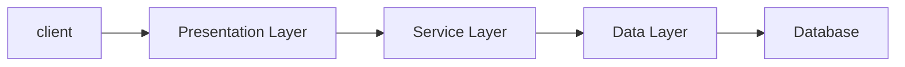

# 💎 스프링 부트 기초(교육 4회차_230418) {#top}
> created : 2023-04-18
> 
> updated : 2023-04-18
> 
> author : 백민주
##
***
## 🔶 목차
1. [강의 Background](#-강의-background)
2. [Review](#-review)
3. [코어기술 2 - AOP](#-aopaspect-oriented-programming-관점-지향-프로그래밍)
4. [자바기초](#-자바-기초)
***
## 🔶 강의 Background
- [수업메모](https://gist.github.com/carami/766a98f1175abb42f42f8923197a4339)
- [JPA를 위한 H2 DBMS 설치](https://www.h2database.com/html/main.html)
- [Maven Repository](https://mvnrepository.com/)
***
## 🔶 Review

- Spring Framework : 복잡다난한 어려운 부분은 Framework가 다 해줌(ex. 다른 Framework와의 결합, JDBC를 통한 DB 접속 등), 개발자는 **규칙**에 맞춰서 개발만 하면 됨
  - Data Layer의 Framework 예시 : MyBatis(중국, 한국에서 많이 사용), JPA(쿼리 작성 용이, 현재 JPA를 표준으로 Spring Framework에서 Interface를 추출했음), hybernate
  - Presentation Layer의 Framework 예시 : spring MVC
- Presentation Layer, Business Layer, Data Layer 전체적으로 **IoC(제어의 역전), AoP(관점지향 프로그래밍)라는 기능**을 사용하고 있음
  - Container : 인스턴스의 생명주기 (JSP Container, Servlet Container 등  
  - **`IoC(Inversion of Control, 제어의 역전)` : 제어하는 게 개발자에서 Framework로 주도권이 넘어가는 것**
    - 방식 1. XML에서 Bean을 통해서(Legacy Project에서는 아직도 사용, 단점 : 무거움, Input type을 선별하지 못해 오류 발생)
    - 방식 2. Java Config에 @Bean을 통해(Spring Boot에서는 대부분 Java Config를 통해 사용, 장점 : 컴파일 시 오류 발생 가능)
    - 방식 3. Annotation으로 @ComponentScan을 통해(@Service, @Repository, @Configuration 등이 Component의 자식)
      - @ComponentScan 할때는 꼭 basePackages를 꼭 지정해야 Component를 읽어올 수 있음
        ```java
        @ComponentScan(basePackages = “examples.di”)
        ```
  - **`DI(Dependency Injection, 의존성 주입)` : 클래스 사이의 의존 관계를 빈(Bean) 설정 정보를 바탕으로 컨테이너가 자동으로 연결해주는 것** (장점 : 인스턴스의 생명주기 제어, AOP방식으로 공통 기능 사용 가능, 결합도를 낮춤)
    - 방식 1. 필드를 통한 주입방식(예시. @Autowired, @Resource)(개발자들이 비선호 why? Framework에 종속되어 결합도가 높아지기 때문에)
    - 방식 2. 생성자를 통한 주입방식(개발자가 직접 생성자에 주입해야함)
    - 방식 3. 설정자(Setter Method)를 통한 주입방식
    - 용어 1. Bean : 스프링에서 DI를 사용하기 위해 생성되는 객체(Default : Singleton Scope)
    - 용어 2. BeanFactory : 스프링에서 Bean을 생성하고 관리하는 컨테이너
    - 용어 3. ApplicationContext : BeanFactory를 상속한 스프링 컨테이너로 더 다양한 기능을 제공
    - 용어 4. Qualifier : 같은 타입의 Bean이 여러 개 있을 경우, 어떤 Bean을 사용할지 결정하는 용도로 사용
    - 용어 5. Autowiring : 자동으로 Bean을 주입하는 기능으로, @Autowired 애노테이션을 통해 사용
      - 오토와이어링 방식 1. 타입을 사용한 방식(autowiring by type)
      - 오토와이어링 방식 2. 이름을 사용한 방식(autowiring by name) 
    - 용어 6. Scope : 빈의 생존기간 = 빈의 생성주기와 관련된 범위
      - 스프링 프레임워크에서 사용 가능한 스코프 1. singleton
      - 스프링 프레임워크에서 사용 가능한 스코프 2. prototype
      - 스프링 프레임워크에서 사용 가능한 스코프 3. request
      - 스프링 프레임워크에서 사용 가능한 스코프 4. session
  - **`AoP(Aspect Oriented Programming, 관점 지향 프로그래밍)`**
***
## 🔶 AOP(Aspect Oriented Programming, 관점 지향 프로그래밍)
- AOP는 객체지향을 좀더 **객체지향스럽게** 만드는 방법
  - 목적 : 중복을 줄여서 적은 코드 수정으로 전체 변경을 할 수 있게 하자
  - 기초개념 : 관심의 분리(Separation of Concerns)
    - **핵심관심(업무로직) + 횡단관심(트랜잭션/로그/보안/인증 처리 등)으로 관심의 분리를 실현** = 위빙(Weaving)
    - 업무개발자는 "핵심관심"만 신경쓰면 됨
    - 그래서 **AOP는 Proxy를 통해 작동**
      - ❔ Proxy란? : DI 컨테이너는 빈을 가져올 때, 해당 빈을 감싸는 Proxy 객체를 생성할 수 있음. Proxy 객체는 빈의 메서드 호출을 가로채서 보안, 로깅, 트랜잭션 등의 작업을 수행할 수 있음.
- 자바 AOP 도구 예시) AspectJ, JBossAOP, SpringAOP
- AOP 용어
  - Joinpoint : 메소드를 호출하는 시점
  - Advice : 횡단관점, Joinpoint에서 실행되어야하는 코드
    - Advice 유형(Annotation, 실행시점에 따라): Before, After Returing, After Throwing, After, Around 
  - target : 핵심관점(업무로직), 실제적인 비즈니스 로직 구현 코드
  - Pointcut : Target 클래스와 Adivce가 결합될 때 둘 사이의 결합규칙(어떤 메서드가 실행될 때 Advice를 실행해줘!)
    - [포인트컷 지시자 자료 링크](https://ittrue.tistory.com/233)
  - Aspect = Adivce + Pointcut
  - Weaving : Joinpoint들을 Adivce로 감싸는 과정, Weaving 하는 작업을 도와주는 것이 AOP 툴이 하는 역할
- AOP 사용 준비 : build.gradle에 아래 내용 추가 필요
  ```java
  implementation 'org.springframework.boot:spring-boot-starter-aop'
  ```
- AOP 코드 설계 = **Aspect를 잘 만들어야 한다**
  ```java
  @Component // 객체를 Bean화(=Instace화)
  @Aspect
  public class MyFirstAspect {

    /* Advice(Before)를 실행하려면 Pointcut(괄호 안)이 필요함 */
    @Before("execution (* com.example..*.addProduct(..))")
    public void before(JoinPoint joinPoint) {
        // @Before라는 annotation 때문에 Method가 실행되기 전에 실행됨
        System.out.println("hello~~~~~~ Before!!!! ################JoinPoint");
    }
  }
  ```
***
## 🔶 자바 기초
