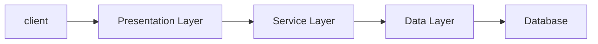

# 💎 스프링 부트 기초(교육 4회차_230418) {#top}
> created : 2023-04-18
> 
> updated : 2023-04-18
> 
> author : 백민주
##
***
## 🔶 목차
1. [강의 Background](#-강의-background)
2. [Review](#-review)
3. [코어기술 2 - AOP](#-aopaspect-oriented-programming-관점-지향-프로그래밍)
4. [Web Application 제작을 위한 기초개념](#-web-application-제작을-위한-기초개념)
    - [JPA](#-jpa)
5. [자바기초](#-자바-기초)
***
## 🔶 강의 Background
- [수업메모](https://gist.github.com/carami/766a98f1175abb42f42f8923197a4339)
- [JPA를 위한 H2 DBMS 설치](https://www.h2database.com/html/main.html)
  - [H2 DDL auto 옵션 및 주의할 점](https://smpark1020.tistory.com/140)
- [Maven Repository](https://mvnrepository.com/)
***
## 🔶 Review

- Spring Framework : 복잡다난한 어려운 부분은 Framework가 다 해줌(ex. 다른 Framework와의 결합, JDBC를 통한 DB 접속 등), 개발자는 **규칙**에 맞춰서 개발만 하면 됨
  - Data Layer의 Framework 예시 : MyBatis(중국, 한국에서 많이 사용), JPA(쿼리 작성 용이, 현재 JPA를 표준으로 Spring Framework에서 Interface를 추출했음), hybernate
  - Presentation Layer의 Framework 예시 : spring MVC
- Presentation Layer, Business Layer, Data Layer 전체적으로 **IoC(제어의 역전), AoP(관점지향 프로그래밍)라는 기능**을 사용하고 있음
  - Container : 인스턴스의 생명주기 (JSP Container, Servlet Container 등  
  - **`IoC(Inversion of Control, 제어의 역전)` : 제어하는 게 개발자에서 Framework로 주도권이 넘어가는 것**
    - 방식 1. XML에서 Bean을 통해서(Legacy Project에서는 아직도 사용, 단점 : 무거움, Input type을 선별하지 못해 오류 발생)
    - 방식 2. Java Config에 @Bean을 통해(Spring Boot에서는 대부분 Java Config를 통해 사용, 장점 : 컴파일 시 오류 발생 가능)
    - 방식 3. Annotation으로 @ComponentScan을 통해(@Service, @Repository, @Configuration 등이 Component의 자식)
      - @ComponentScan 할때는 꼭 basePackages를 꼭 지정해야 Component를 읽어올 수 있음
        ```java
        @ComponentScan(basePackages = “examples.di”)
        ```
  - **`DI(Dependency Injection, 의존성 주입)` : 클래스 사이의 의존 관계를 빈(Bean) 설정 정보를 바탕으로 컨테이너가 자동으로 연결해주는 것** (장점 : 인스턴스의 생명주기 제어, AOP방식으로 공통 기능 사용 가능, 결합도를 낮춤)
    - 방식 1. 필드를 통한 주입방식(예시. @Autowired, @Resource)(개발자들이 비선호 why? Framework에 종속되어 결합도가 높아지기 때문에)
    - 방식 2. 생성자를 통한 주입방식(개발자가 직접 생성자에 주입해야함)
    - 방식 3. 설정자(Setter Method)를 통한 주입방식
    - 용어 1. Bean : 스프링에서 DI를 사용하기 위해 생성되는 객체(Default : Singleton Scope)
    - 용어 2. BeanFactory : 스프링에서 Bean을 생성하고 관리하는 컨테이너
    - 용어 3. ApplicationContext : BeanFactory를 상속한 스프링 컨테이너로 더 다양한 기능을 제공
    - 용어 4. Qualifier : 같은 타입의 Bean이 여러 개 있을 경우, 어떤 Bean을 사용할지 결정하는 용도로 사용
    - 용어 5. Autowiring : 자동으로 Bean을 주입하는 기능으로, @Autowired 애노테이션을 통해 사용
      - 오토와이어링 방식 1. 타입을 사용한 방식(autowiring by type)
      - 오토와이어링 방식 2. 이름을 사용한 방식(autowiring by name) 
    - 용어 6. Scope : 빈의 생존기간 = 빈의 생성주기와 관련된 범위
      - 스프링 프레임워크에서 사용 가능한 스코프 1. singleton
      - 스프링 프레임워크에서 사용 가능한 스코프 2. prototype
      - 스프링 프레임워크에서 사용 가능한 스코프 3. request
      - 스프링 프레임워크에서 사용 가능한 스코프 4. session
  - **`AoP(Aspect Oriented Programming, 관점 지향 프로그래밍)`**
***
## 🔶 AOP(Aspect Oriented Programming, 관점 지향 프로그래밍)
- AOP는 객체지향을 좀더 **객체지향스럽게** 만드는 방법
  - 목적 : 중복을 줄여서 적은 코드 수정으로 전체 변경을 할 수 있게 하자
  - 기초개념 : 관심의 분리(Separation of Concerns)
    - **핵심관심(업무로직) + 횡단관심(트랜잭션/로그/보안/인증 처리 등)으로 관심의 분리를 실현** = 위빙(Weaving)
    - 업무개발자는 "핵심관심"만 신경쓰면 됨
    - 그래서 **AOP는 Proxy를 통해 작동**
      - ❔ Proxy란? : DI 컨테이너는 빈을 가져올 때, 해당 빈을 감싸는 Proxy 객체를 생성할 수 있음. Proxy 객체는 빈의 메서드 호출을 가로채서 보안, 로깅, 트랜잭션 등의 작업을 수행할 수 있음.
- 자바 AOP 도구 예시) AspectJ, JBossAOP, SpringAOP
- AOP 용어
  - Joinpoint : 메소드를 호출하는 시점
  - Advice : 횡단관점, Joinpoint에서 실행되어야하는 코드
    - Advice 유형(Annotation, 실행시점에 따라): Before, After Returing, After Throwing, After, Around 
  - target : 핵심관점(업무로직), 실제적인 비즈니스 로직 구현 코드
  - Pointcut : Target 클래스와 Adivce가 결합될 때 둘 사이의 결합규칙(어떤 메서드가 실행될 때 Advice를 실행해줘!)
    - [포인트컷 지시자 자료 링크](https://ittrue.tistory.com/233)
  - Aspect = Adivce + Pointcut
  - Weaving : Joinpoint들을 Adivce로 감싸는 과정, Weaving 하는 작업을 도와주는 것이 AOP 툴이 하는 역할
- AOP 사용 준비 : build.gradle에 아래 내용 추가 필요
  ```java
  implementation 'org.springframework.boot:spring-boot-starter-aop'
  ```
- AOP 코드 설계 = **Aspect를 잘 만들어야 한다**
  ```java
  @Component // 객체를 Bean화(=Instace화)
  @Aspect
  public class MyFirstAspect {

    /* Advice(Before)를 실행하려면 Pointcut(괄호 안)이 필요함 */
    @Before("execution (* com.example..*.addProduct(..))")
    public void before(JoinPoint joinPoint) {
        // @Before라는 annotation 때문에 Method가 실행되기 전에 실행됨
        System.out.println("hello~~~~~~ Before!!!! ################JoinPoint");
    }
  }
  ```
- JoinPoint 객체 이용하기 및 Pointcut 선언하기
  - ❗ 주의해야할 점 : Signature는 `import org.aspectj.lang.Signature;`가 되어있어야 사용가능
  ```java
    //이런식으로 Pointcut 선언도 가능
    @Pointcut("execution (* com.example..ProductDaoImpl.addProduct(..))")
    private void pc(){}

    @Pointcut("execution (* findProduct(String))")
    private void pc2(){}
    
    @After("pc()")
    public void after(JoinPoint jp){
        //after는 Method가 끝난 다음에 동작하는 Advice
        System.out.println("hello~~~~~~ After!!!! ################JoinPoint");
    }
    
        @AfterReturning(value = "pc2()", returning = "product") // annotation에 2개 인자 넣으려면 이렇게 해야함
    public void afterReturning(JoinPoint jp, Product product) { // IoC를 하면서 jp에 자동으로 넣어줌
        System.out.println("hello~~~~~~ AfterReturning!!!! ################JoinPoint");

        Signature sig = jp.getSignature();
        System.out.println(sig.getName());

        Object[] args = jp.getArgs();
        for (Object object : args) {
            System.out.println("=========================>인자 :::: " + object);
        }

        product.setName("product22222");
    }

    // afterThrowing은 exception이 발생하는 시점에만 실행, 그러면 AfterReturning이 실행이 안됨
    @AfterThrowing(value = "pc2()", throwing = "ex")
    public void afterThrowing(Throwable ex) // throwable은 exception의 조상
    {
        System.out.println("Hello AfterThrowing ============================");
        System.out.println("exception value ::: " + ex);
    }

    @Around("pc2()")
    public Product around(ProceedingJoinPoint pjp) throws Throwable {
        System.out.println("Hello Around 메서드 실행전 ============================");

        // 원래 실행하려던 메서드가 실행되기 전에 해야할 일!!!
        Product product = (Product) pjp.proceed(); // 원래 실행하려고 하던 메서드 호출

        System.out.println("Hello Around  실제 메서드 실행후!!======================");

        // 원래 실행하려던 메서드가 실행된 후에 해야할 일!!!
        product.setPrice(20000);
        return product;
    }
  ```
***
## 🔶 Web Application 제작을 위한 기초개념
### 🔹 JPA
- ❔ **JPA(Java Persistence API)란?** 자바 진영의 ORM 기술 표준
  - ❔ **ORM(Object-relational mapping)이란?** 객체 관계 매핑, 객체는 객체대로 설계, 관계형 DB는 관계형 DB대로 설계
  - 기존의 데이터베이스 프로그래밍이 DTO(data Transfer Object)를 많이 만들게 되는 문제점을 해소하는게 JPA임 → JPA는 SQL 중심적인 개발에서 객체 중심으로 개발
- 우리나라는 Mybatis를 썼지만(전자정부 프레임워크 표준), 외국은 hybernate를 많이 사용
- JPA 관련 용어
  - **영속성 컨텍스트(Persistence context)(JPA에서 가장 중요한 용어)**
    - 엔티티를 영구 저장하는 환경
    - 논리적인 개념과 가까움
    - 엔티티 매니저로 만들어짐
    - **`@Entity`로 지정한 객체에 `@Id`라는 Key가 꼭 있어야함** [참고코드](#db에-table-생성)
  - 엔티티 생명주기
    - 비영속/영속 : 영속성 컨텍스트와 관계가 없거나/저장된(persist() 호출) 상태
- JPA 프로젝트 생성 방법
  - 가. `Ctrl + Shift + P` `Java: Create Java Project...`
  - 나. 이번엔 Maven으로: maven-archetype-quickstart
  - 다. 버전은 1.4로
  - 라. Enter 2번 치기
  - 마. 파일구조 확인(pom.xml)
  - 바. pom.xml에 데이터베이스 및 hibernate 연결
- 코드 실행 되는대로 DB에 연결하는 옵션(persistence.xml)
  ```xml
  <property name="hibernate.hbm2ddl.auto" value="update" />
  ```
- DB 연결 unit name 지정(persistence.xml)
  ```xml
  <persistence-unit name="jpaexam">
  ```
#### DB에 Table 생성
  ```java
  package com.example.jpaexam.domain;

  import javax.persistence.Entity;
  import javax.persistence.Id;

  @Entity
  public class Product {

    @Id
    @GeneratedValue //id값을 알아서 제대로 만들어줌
    private long id;
    private String name;
    private int price;
    
    //Getter, Setter, ToString() 모두 있어야함
  }
  ```
#### JapRun 코드
  ```java
  public class JapRun {

    public static void main(String[] args) {
        EntityManagerFactory emf = Persistence.createEntityManagerFactory("jpaexam"); //persistence.xml의 unit name과 일치하면 됨
        EntityManager em = emf.createEntityManager();
    }
  }
  ```
  
#### Entity 저장
- **트랜잭션으로 묶어줘야 Entity 저장이 가능**
     ```java
        EntityTransaction tx = em.getTransaction();
        tx.begin(); // 트랜잭션은 try-catch로 묶어주는 게 좋음
        try {
            Product product = new Product(); // 엔티티 생성 //비영속 상태
            product.setId(1L);
            product.setName("pen");
            product.setPrice(3000);

            em.persist(product); // persist : Entity가 영속상태가 됨
            System.out.println("######persist() 수행 후");
            tx.commit(); // DB에 저장
            System.out.println("######commit() 수행 후");
        } catch (Exception e) {
            // TODO: handle exception
            tx.rollback();
            e.printStackTrace();
        }
    ```
***
## 🔶 자바 기초
- Map 이용방법(Map은 Interface임)
  ```java
  private Map<String, Product> storage = new HashMap<>();
  ```
***
[맨 위로 가기](#top)
