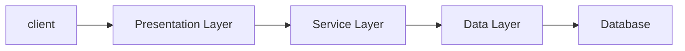

# 💎 스프링 부트 기초(교육 4회차_230418) {#top}
> created : 2023-04-18
> 
> updated : 2023-04-18
> 
> author : 백민주
##
***
## 🔶 목차
1. [강의 Background](#-강의-background)
2. [Review](#-review)
3. [자바기초](#-자바-기초)
***
## 🔶 강의 Background
- **[수업메모](https://gist.github.com/carami/f924bbbca225e9443b25479c477bf6e6)**
- [JPA를 위한 H2 DBMS 설치](https://www.h2database.com/html/main.html)
***
## 🔶 Review

- Spring Framework : 복잡다난한 어려운 부분은 Framework가 다 해줌(ex. 다른 Framework와의 결합, JDBC를 통한 DB 접속 등), 개발자는 **규칙**에 맞춰서 개발만 하면 됨
  - Data Layer의 Framework 예시 : MyBatis(중국, 한국에서 많이 사용), JPA(쿼리 작성 용이, 현재 JPA를 표준으로 Spring Framework에서 Interface를 추출했음)
  - Presentation Layer의 Framework 예시 : spring MVC
- Presentation Layer, Business Layer, Data Layer 전체적으로 **IoC(제어의 역전), AoP(관점지향 프로그래밍)라는 기능**을 사용하고 있음
  - **`IoC(Inversion of Control, 제어의 역전)` : 제어하는 게 개발자에서 Framework로 주도권이 넘어가는 것**
    - 방식 1. XML에서 Bean을 통해서(Legacy Project에서는 아직도 사용, 단점 : 무거움, Input type을 선별하지 못해 오류 발생)
    - 방식 2. Java Config에 @Bean을 통해(Spring Boot에서는 대부분 Java Config를 통해 사용, 장점 : 컴파일 시 오류 발생 가능)
    - 방식 3. Annotation으로 @ComponentScan을 통해(@Service, @Repository, @Configuration 등이 Component의 자식)
  - **`DI(Dependency Injection, 의존성 주입)` : 선언한 기능을 쓰고 싶을 때 알맞는 데이터(ex. Bean)을 주입하는 방법**
    - 방식 1. 필드를 통한 주입방식(예시. @Autowired, @Resource)(개발자들이 비선호 why? Framework에 종속되어 결합도가 높아지기 때문에)
    - 방식 2. 생성자를 통한 주입방식(개발자가 직접 생성자에 주입해야함)
    - 방식 3. 설정자(Setter Method)를 통한 주입방식
  - **`AoP(Aspect Oriented Programming, 관점 지향 프로그래밍)`**
***
## 🔶 AOP(Aspect Oriented Programming, 관점 지향 프로그래밍)
***
## 🔶 자바 기초
